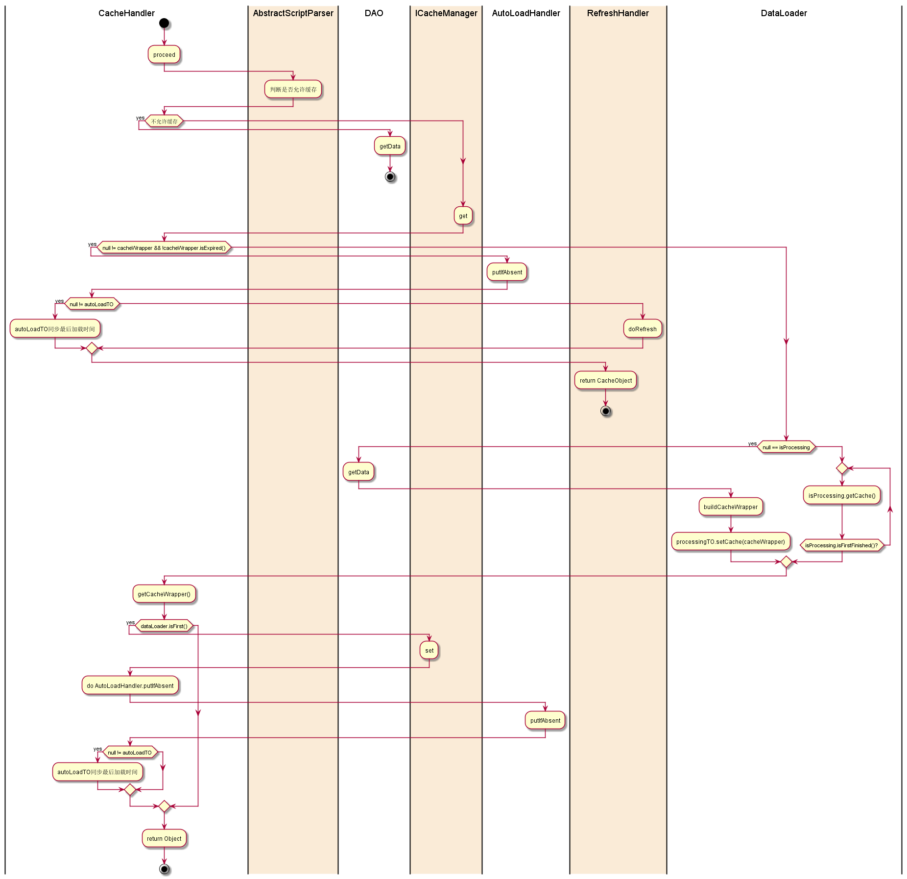

###设计思想及原理

如下图所示：

AOP拦截到请求后：
>1. 根据请求中的注解@Cache生成缓存Key；
>2. 根据缓存Key去缓存中获取数据
  * 如果有数据，则判断是否是需要自动加载，如果需要，则把相关数据封装到AutoLoadTO中，并交给AutoLoadHandler进行处理；如果不需要自动加载、则判断缓存是否快要过期，如果快要过期则开启新的线程刷新缓存，由RefreshHandler来处理。最后把缓存数据返回给用户；
  * 如果没有数据，则去数据层加载数据
>3. 去数据层获取数据时，为了减少并发，增加等待机制（拿来主义机制）：如果多个用户同时取一个数据，那么先让第一个请求去DAO取数据，其它请求则等待其返回后，直接从内存中获取，等待一定时间后，如果还没获取到，则会去数据层获取数据。
>4. 如果是第一个获取数据的请求，判断是否需要自动加载。并把数据写入缓存；
>5. 把数据返回给用户。

AutoLoadHandler（自动加载处理器）主要做的事情：当缓存即将过期时，去执行DAO的方法，获取数据，并将数据放到缓存中。为了防止自动加载队列过大，设置了容量限制；同时会将超过一定时间没有用户请求的也会从自动加载队列中移除，把服务器资源释放出来，给真正需要的请求。

**使用自加载的目的:**
>1. 避免在请求高峰时，因为缓存失效，而造成数据库压力无法承受;
>2. 把一些耗时业务得以实现。
>3. 把一些使用非常频繁的数据，使用自动加载，因为这样的数据缓存失效时，最容易造成服务器的压力过大。

**分布式自动加载**

如果将应用部署在多台服务器上，理论上可以认为自动加载队列是由这几台服务器共同完成自动加载任务。比如应用部署在A,B两台服务器上，A服务器自动加载了数据D，（因为两台服务器的自动加载队列是独立的，所以加载的顺序也是一样的），接着有用户从B服务器请求数据D，这时会把数据D的最后加载时间更新给B服务器，这样B服务器就不会重复加载数据D。

##为什么要使用自动加载机制？

首先我们想一下系统的瓶颈在哪里？

1. 在高并发的情况下数据库性能极差，即使查询语句的性能很高；如果没有自动加载机制的话，在当缓存过期时，访问洪峰到来时，很容易就使数据库压力大增，而影响到整个系统的稳定。

2. 往缓存“写”数据与从缓存读数据相比，效率也差很多，因为写缓存时需要分配内存等操作。使用自动加载，可以减少同时往缓存写数据的情况，同时也能提升缓存服务器的吞吐量。
3. 还有一些比较耗时的业务得以实现。

注：上面提到的两种异步刷新数据机制，如果从数据层获取数据时，发生异常，则会使用旧数据进行续租。

##如何减少DAO层并发

1. 使用缓存；
2. 使用自动加载机制，因“写”数据往往比读数据性能要差，使用自动加载也能减少写缓存的并发。
3. 从DAO层加载数据时，**增加等待机制**（拿来主义）

##使用规范

1. 将调接口或数据库中取数据，**封装在DAO层**，不能什么地方都有调接口的方法。
2. 自动加载缓存时，**不能**在缓存方法内**叠加（或减）**查询条件值，但允许设置值。
3. DAO层内部，没使用@Cache的方法，不能调用加了@Cache的方法，避免AOP失效。
4. 对于比较大的系统，要进行**模块化设计**，这样可以将自动加载，均分到各个模块中。

##为了能让更多人使用此项目，一直在为具有更好的扩展性而努力，在以下几个方法已实现可扩展：

1. 缓存：现在已经支持Memcache、Redis、ConcurrentHashMap三种缓存，用户也可以自己增加扩展；
2. AOP：项目中已经实现了Spring AOP的拦截。在Nutz官方项目中也实现了相关的插件：https://github.com/nutzam/nutzmore/tree/master/nutz-integration-autoloadcache
3. 表达式解析用户也是可以根据自己的需要来进行扩展，也可以使用项目中已经实现的Spring EL表达式，或Javascript表达式；
4. 序列化工具：项目中已经支持：Fastjson、Hessian2、Jdk自带等序列化工具；
5. 数据压缩：已经支持基于Apache commons compress 实现的GZIP，BZIP2，XZ，PACK200，DEFLATE等压缩算法，也支持用户自已实现扩展。
6. 深度复制工具，默认使用了高性能的cloning，也可以使用上述的序列化工具。
